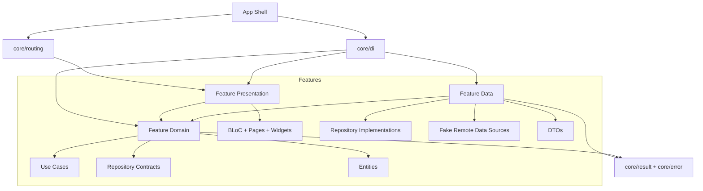

# Flutter Clean Architecture Starter

A runnable Flutter Reference Starter for Project Management workflows.

This repository is not a template-only folder layout. It demonstrates a concrete Data Flow through Authentication, protected Projects, Project-scoped Tasks, dependency composition, localization, and boundary-focused tests.

## Reference Flow

The app ships with a fake API and a complete demo path:

1. Start unauthenticated.
2. Attempt to open Projects and get redirected to Authentication.
3. Sign in with:
   - Email: `demo@example.com`
   - Password: `password`
4. Open the `Reference Starter` Project.
5. View Project-scoped Tasks.
6. Toggle a Task completion state.
7. Sign out and return to Authentication.

## Tech Stack

- Flutter and Dart
- `flutter_bloc` for presentation state
- `go_router` for routing and Session guards
- `get_it` and `injectable` for dependency composition
- `equatable` for value equality
- Flutter localization via `gen-l10n`
- `flutter_test` and `bloc_test` for behavior and boundary tests

## Architecture



The code is organized feature-first:

```text
lib/
  app/
  core/
    config/
    di/
    error/
    layout/
    result/
    routing/
    theme/
    use_cases/
  features/
    auth/
      data/
      domain/
      presentation/
    projects/
      data/
      domain/
      presentation/
    tasks/
      data/
      domain/
      presentation/
```

Architecture guardrails:

- BLoC belongs only in presentation.
- `get_it` and `injectable` belong only in `lib/core/di`.
- DTOs belong only in data.
- Domain entities, repository contracts, and use cases do not import Flutter widgets, BLoC, routing, DI, DTOs, or transport exceptions.
- Repositories translate data-source exceptions into domain-facing Failures.
- Widgets translate BLoC state; they do not parse data-source or transport errors.

These rules are covered by `test/architecture/import_boundary_test.dart`.

## Running Locally

Install dependencies:

```sh
flutter pub get
```

Run the dev app:

```sh
flutter run -t lib/main_dev.dart
```

Run the production-configured entry point:

```sh
flutter run -t lib/main_prod.dart
```

The default `lib/main.dart` also starts the app with the shared starter configuration.

## Validation

Run the full test suite:

```sh
flutter test
```

Run static analysis:

```sh
flutter analyze
```

Build macOS:

```sh
flutter build macos
```

Format the codebase:

```sh
dart format .
```

## Localization

Source strings live in:

```text
lib/l10n/app_en.arb
```

Generated localization files live under `lib/l10n/generated/` and should be regenerated instead of hand-edited:

```sh
flutter gen-l10n
```

## Current State

The starter currently includes:

- Session guard tracer bullet
- Core Result and Failure flow
- Authentication Feature
- Dependency composition through `core/di`
- Projects Feature
- Project-scoped Tasks Feature
- End-to-end reference flow
- Import boundary audit tests
