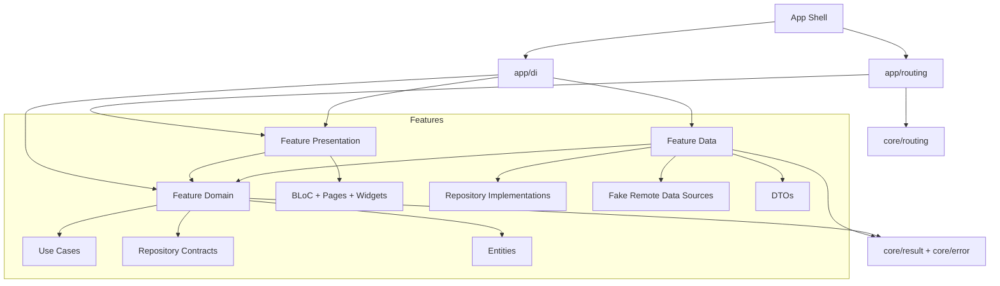

# Flutter Clean Architecture Starter

A runnable Flutter Reference Starter for Project Management workflows.

This repository is not a template-only folder layout. It demonstrates a concrete Data Flow through Authentication, protected Projects, Project-scoped Tasks, dependency composition, typed error handling, localization, and boundary-focused tests.

## Reference Flow

The app ships with a fake API and a complete demo path:

1. Start unauthenticated.
2. Attempt to open Projects and get redirected to Authentication.
3. Sign in with:
   - Email: `demo@example.com`
   - Password: `password`
4. Load, create, update, and delete Projects.
5. Open the `Reference Starter` Project.
6. Load, create, update, toggle completion, and delete Project-scoped Tasks.
7. Sign out and return to Authentication.

## What This Starter Proves

This starter proves the architecture with runnable behavior, not folder names alone:

- Protected routing is driven by Session state without coupling data sources to routing guards.
- Feature presentation is composed at the app boundary, keeping `core` free from feature UI imports.
- Use cases expose domain intent and can own validation before repositories are called.
- Repositories translate transport-shaped errors into typed domain Failures.
- Projects cover list/create/update/delete behavior end to end.
- Tasks cover list/create/update/toggle/delete behavior inside a Project.
- BLoCs emit predictable UI states for loading, loaded, empty, failure, and mutations.
- Tests cover boundaries, use case orchestration, repository mapping, BLoC transitions, widgets, and the end-to-end reference flow.

## Tech Stack

- Flutter and Dart
- `flutter_bloc` for presentation state
- `go_router` for routing and Session guards
- `get_it` and `injectable` for dependency composition
- `equatable` for value equality
- Flutter localization via `gen-l10n`
- `flutter_test` and `bloc_test` for behavior and boundary tests

## Architecture



The code is organized feature-first:

```text
lib/
  app/
    di/
    routing/
  core/
    config/
    error/
    layout/
    result/
    routing/
    theme/
    use_cases/
  features/
    auth/
      data/
      domain/
      presentation/
    projects/
      data/
      domain/
      presentation/
    tasks/
      data/
      domain/
      presentation/
```

Architecture guardrails:

- BLoC belongs only in presentation.
- `get_it` and `injectable` belong only in `lib/app/di`.
- Core runtime modules do not import feature presentation; app routing owns UI route composition.
- DTOs belong only in data.
- Domain entities, repository contracts, and use cases do not import Flutter widgets, BLoC, routing, DI, DTOs, or transport exceptions.
- Repositories translate data-source exceptions into domain-facing Failures.
- Widgets translate BLoC state; they do not parse data-source or transport errors.

These rules are covered by `test/architecture/import_boundary_test.dart`.

## Error Handling

The data layer throws transport-shaped `RemoteException`s. Repositories translate those exceptions into domain-facing `Failure`s before results cross into use cases or presentation.

Current failure taxonomy:

- `UnauthorizedFailure` for rejected credentials or expired access.
- `ValidationFailure` for invalid input, with optional `fieldErrors`.
- `NotFoundFailure` for missing Projects or Tasks.
- `NetworkFailure` for unavailable remote sources.
- `RemoteFailure` as a fallback for unclassified remote errors.
- `UnexpectedFailure` for non-remote domain/application failures.

The mapping lives in `lib/core/error/remote_failure_mapper.dart`, keeping repositories consistent and keeping BLoCs/UI free from transport details.

## Test Strategy

The suite is intentionally layered:

- Architecture tests protect import boundaries and keep `core` independent from feature presentation.
- Repository tests verify exception-to-failure mapping and CRUD behavior.
- Use case tests verify orchestration, repository calls, and domain validation such as required Project names.
- BLoC tests verify user-facing state transitions: loading, authenticated, loaded, empty, failure, create/update/delete, and Task completion toggles.
- Widget and reference-flow tests verify the runnable app path from Authentication through protected Projects and Tasks.

## Running Locally

Install dependencies:

```sh
flutter pub get
```

Run the dev app:

```sh
flutter run -t lib/main_dev.dart
```

Run the production-configured entry point:

```sh
flutter run -t lib/main_prod.dart
```

The default `lib/main.dart` also starts the app with the shared starter configuration.

## Validation

Run the full test suite:

```sh
flutter test
```

Run static analysis:

```sh
flutter analyze
```

Build macOS:

```sh
flutter build macos
```

Format the codebase:

```sh
dart format .
```

## Localization

Source strings live in:

```text
lib/l10n/app_en.arb
```

Generated localization files live under `lib/l10n/generated/` and should be regenerated instead of hand-edited:

```sh
flutter gen-l10n
```

## Current State

The starter currently includes:

- Session guard tracer bullet
- Core Result and typed Failure flow
- Authentication Feature
- App-level routing through `app/routing`
- Dependency composition through `app/di`
- Projects Feature
- Project-scoped Tasks Feature
- Use case validation for required Project names
- End-to-end reference flow
- Import boundary audit tests
- 55 passing tests across architecture, domain, data, presentation, and app flow
